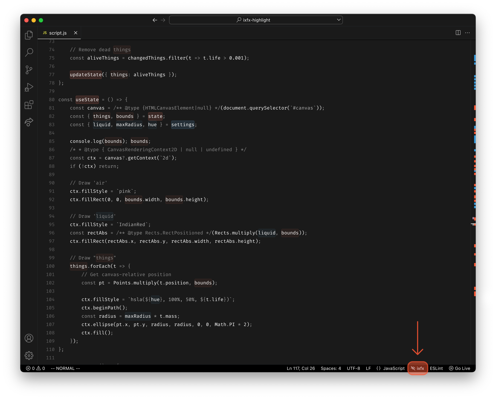

# ixfx Highlight

Code syntax highlighting is traditionally limited to the current programming language's syntax, unaware of the context of what we are making. 

_ixfx Highlight_ is a prototype investigating a novel approach to _context-aware syntax highlighting._ It assumes that your code employs the conventions of [ClintH/ixfx](https://github.com/ClintH/ixfx), a functional framework for sketching and prototyping interactivity. ixfx uses a pattern of [`state` and `settings` objects](https://github.com/ClintH/ixfx-demos/blob/main/CODE-STYLE.md#settings), explicating stateful and configuration variables. The prototype highlights these objects and instances where they are used in code using a predictable background color.

The extension makes it possible to engage with the code on another conceptual level by explicating a context-aware understanding of the program level state.

**[Download _ixfx Highlight_ on the VS Code Marketplace.](https://marketplace.visualstudio.com/items?itemName=motform.ixfx-highlight)**

---

The current iteration of _ixfx Highlight_ uses simple regular expressions to find the related variable names. As such, it is easy to run into edge cases that the regex can't handle. Sadly, VS Code does not expose a public API to hook into whatever process is responsible for the syntax highlighting for the particular file. As such, we are stuck with regex in lieu of a separate parser, like  [tree-sitter](https://tree-sitter.github.io/tree-sitter/).

_ixfx Highlight_ is primarily an aid to students learning how to prototype interactivity using ixfx. It is oddly specific and will likely not have practical non-ixfx-users. However, I hope it might provoke some thoughts or ideas. Feel free to [reach out](www.motform.org) if you also find the notion of a context-aware text editor.

## Features

_ixfx Highlight_ follows [ixfx convention](https://github.com/ClintH/ixfx-demos/blob/main/CODE-STYLE.md) and highlights instances of variable called `state` and `settings`, along with any destructured properties. You can turn the highlights on or off using the status bar icon in the bottom right.

I recommend pairing _ixfx Highlight_ with a restrained color theme, as busier ones might overpower the relatively subtle backgrounds. The screenshots use Niki Tonsky's [Alabaster](https://marketplace.visualstudio.com/items?itemName=tonsky.theme-alabaster) and Mike Hodgson's [Monochorme Dark](https://marketplace.visualstudio.com/items?itemName=mikehhodgson.monochrome-dark).

The extension is limited to JavaScript or TypeScript files.

## Extension Settings
You can change the base colors to highlight `state` and `settings`. Note that these will dim by lowering the opacity, so you will want to pick something solid and vibrant.

- `ixfx-highlight.color.settings.dark`: The settings color used in dark color themes, a 6 digit hex color.
- `ixfx-highlight.color.settings.light`: The settings color used in dark color themes, a 6 digit hex color.
- `ixfx-highlight.color.state.dark`: The state color used in dark color themes, a 6 digit hex color.
- `ixfx-highlight.color.state.light`: The state color used in light color themes, a 6 digit hex color.

You can also control the prominence (opacity) of highlights.

- `ixfx-highlight.color.prominence`: `"Low"` | `"Medium"` | `"High"`

All of the settings are configurable in the GUI as well.

## Known Issues

The current prototype has a few limitations, none of which should be disruptive.

- Currently only highlights destructured properties. That is, in part, a good thing since it inadvertently highlights ignored properties. Remember, in every bug there lives a latent feature.
- Kind of iffy with nested objects.
- Does not consider your color theme; see above for recommendations.
- Only highlights the active file (the active editor, in VS Code parlance). This becomes an issue when you split the view; it won't highlight an inactive but visible file, which stems from the fact that we only handle the active editor. It is not the biggest problem, but fixing it would require cross-editor state management, which is a potentially annoying thing to do in the VS Code API.

## Release Notes

### 1.1.X

Add configuration of highlight colors and prominence.

### 1.0.X

Initial release, with minor patches. Covers the basic usecase.